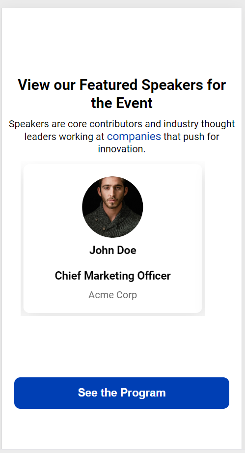

# Specbee Event Speakers

This project presents a visually engaging list of featured event speakers, built using Vanilla JavaScript, HTML, and SCSS. It incorporates an interactive speaker carousel for easy browsing and a responsive modal for viewing detailed speaker profiles

## Key Features

- **Speaker Slider**: Speaker Carousel: Users can seamlessly scroll through speakers with "Previous" and "Next" buttons for a smooth navigation experience.
- **Speaker Detail Modal**: Clicking on any speaker opens a modal that reveals more about the individual, including their name, position, organization, social media links, and a brief bio.

- **Responsive Design**:The application is fully responsive, ensuring an optimal experience on various screen sizes, from mobile devices to large desktops.

## Technologies Used

- **HTML**:Structures the content layout and modal elements.
- **CSS (SASS)**: Styles the page with a focus on responsive design and an appealing layout.
- **Vanilla JavaScript**: Powers dynamic rendering of the speaker data and modal interactions.

- **Figma**: Used for designing the layout and visual components before development.

## Screenshots


_The interactive speaker carousel with "Previous" and "Next" buttons._


_Modal displaying detailed speaker profile, including name, position, organization, social media links, and bio._


_Responsive layout adjusting for various screen sizes._

## Getting Started

1. Clone the repository:
   ```bash
   git clone https://github.com/sislam824/speaker_card_slider.git
   ```
